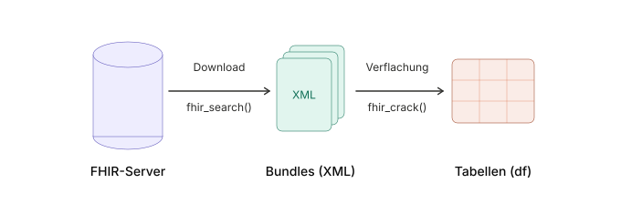

# Begrüßung

## Inhalt des Workshops

-   Überblick über Grundfunktionalitäten des `fhircrackr`
-   Erste Funktionen ausprobieren
-   Voraussetzung:
    -   R und RStudio installiert
    -   Internetzugang
    -   Materialien im GitHub Repo: [https://github.com/palmjulia/miracum_autumn_school](https://github.com/palmjulia/miracum_autumn_school)
    
## Was ist der fhircrackr?

-   R-Paket zum Verarbeiten von HL7 FHIR Ressourcen
-   Zu Beginn der MII als kurzfristige Lösung zum Verflachen von FHIR entwickelt
-   Stabile Version auf [CRAN](https://CRAN.R-project.org/package=fhircrackr), Development auf [GitHub](https://github.com/POLAR-fhiR/fhircrackr)
-   Verwendung in zahlreichen Use Cases der MII (z.B. InterPOLAR, HELP, CORD)
-   Sollte inzwischen von DUP-Pipeline abgelöst sein, Prozess ongoing

## Verarbeitungsschritte



## Play along: Code-Beispiele

::: {style="font-size: 0.7em;"}
-   *fhircrackr_intro.R* durch Doppelklick in RStudio öffnen
-   Code kann zeilenweise oder im Block ausgeführt werden
:::

. . .

``` {.r code-line-numbers="1-2|4-5|7-9|11-13"}
#erste Installation (1x pro Maschine)
install.packages("fhircrackr")

#Paket laden (1x pro R Session)
library(fhircrackr)

#Zuweisung
x <- 3
x

#named vector
c(a = "Affe", b = "Banane")
```

```{r}
#| echo: false
#| message: false
#| output: false
#Paket laden (1x pro R Session)
library(fhircrackr)

#Zuweisung
x <- 3
x

#named vector
c(a = "Affe", b = "Banane")

```

::: callout-tip
Code markieren und `Strg + Enter` drücken.
:::

# FHIR herunterladen

## FHIR Search Requests

*Beispiel:* Weibliche Patieten mit Geburtsjahr nach 1990

`https://mii-agiop-3p.life.uni-leipzig.de/blaze/`\ 
`Patient?gender=female&birthdate=gt1990`


```{r}
#| code-line-numbers: "1-2|3|4-5|7-8"
#| output-location: fragment

#FHIR Search Request zusammenbauen
request <- fhir_url(url = "https://mii-agiop-3p.life.uni-leipzig.de/blaze",
                    resource = "Patient",
                    parameters = c(gender = "female",
                                   birthdate = "gt1990"))

#Objekt inspizieren
request
```

## Ressourcen herunterladen per GET

```{r}
#| code-line-numbers: "1-3|5-6"
#| output-location: fragment
#Download
bundles <- fhir_search(request = request,
                       max_bundles = 2)

#Ergebnis
bundles
```

## XML-Bundle Representation

```{r}
#| output-location: fragment
#einzelnes Bundle
cat(toString(bundles[[1]]))
```

## Optionen für `fhir_search()`

-   Funktion `fhir_search()` führt FHIR Search Request inklusive automatischem Paging aus
-   Doku aufrufen mit `?fhir_search`
-   Einige optionale Parameter:
    -   `max_bundles` begrenzt Anzahl der Bundles im Paging
    -   `username`, `password` und `token` für Authentifizierung
    -   `delay_between_attempts` und `delay_between_bundles` steuern Wartezeit zwischen Verbindungsversuchen
    -   `save_to_disc` speichert Bundles auf Platte statt in R-Session

## Ressourcen herunterladen per POST

-   Für besonders lange Search Requests ist manchmal nur eine Suche per POST möglich
-   z.B. wenn viele lange IDs an den Suchparameter `_id` übergeben werden sollen

. . .

```{r}
#| output-location: fragment
#| code-line-numbers: "1-2|4-7" 
request <- fhir_url(url = "https://mii-agiop-3p.life.uni-leipzig.de/blaze",
                    resource = "Patient")

#body definieren
body <- fhir_body(content = list(gender = "female",
                                 birthdate = "gt1990"))
body
```

## Ressourcen herunterladen per POST

```{r}
#| output-location: fragment
#download
bundles <- fhir_search(request = request,
                       body = body,
                       max_bundles = 2)
bundles
```

## Umgang mit HTTP-Fehlern

-   Quellen: Authentifizierung, Tippfehler in der URL, nicht implementierte Parameter...
-   Mit Argument `log_errors = <file>` in spezifizierte Datei schreiben lassen
-   Über `fhir_recent_http_error()` den zuletzt geworfenen Fehler aufrufen

. . .

```{r}
#| output-location: fragment
#| error: true
#Fehlende Authentifizierung
fhir_search("https://mii-agiop-polar.life.uni-leipzig.de/blaze/Patient", 
            stop_on_error = 1)
```

## Umgang mit HTTP-Fehlern

```{r}
#| output-location: fragment
#Fehler aufrufen
cat(fhir_recent_http_error())
```

# FHIR Verflachen

## Table Description

::: {style="font-size: 0.6em;"}
-   Vorschrift zur Verflachung von Bundles mit `fhir_crack()`
-   Einfachste Form: nur den Ressourcentyp angeben
-   Alle anderen Eigenschaften erhalten dann Default-Werte
:::

. . .

```{r}
#| output-location: fragment
pat_desc <- fhir_table_description(resource = "Patient")
pat_desc
```

## Extraktion aller Elemente {.scrollable}

```{r}
#| output: false
#cracken
patients <- fhir_crack(bundles = bundles, design = pat_desc)
View(patients)
```

. . .

```{r}
#| echo: false
knitr::kable(head(patients)) |>
  kableExtra::kable_styling(font_size = 18)
```

## Extraktion definierter Spalten

::: {style="font-size: 0.6em;"}
-   Einschränkung der zu extrahierenden Elemente über `cols` Element der Table Description
-   Definition der Elemente über XPath (1.0) Expressions
-   Spaltennamen können automatisch generiert oder frei gewählt werden
:::

. . .

```{r}
#| output-location: fragment
pat_desc <- fhir_table_description(resource = "Patient",
                                   cols = c(Id = "id",
                                            Stadt = "address/city",
                                            Geschlecht = "gender"))
pat_desc
```

## Extraktion definierter Spalten {.scrollable}

```{r}
#| output: false

#cracken
patients <- fhir_crack(bundles = bundles, design = pat_desc)
View(patients)
```

. . .

```{r}
#| echo: false
knitr::kable(patients)|>
  kableExtra::kable_styling(font_size = 24) 
```

## Multiple Elemente

::: {style="font-size: 0.6em;"}
-   FHIR Ressourcen können für das gleiche Element (z.B. `Observation.code.coding`) mehrere Einträge haben
:::

. . .

```{r}
#Beispielbundle verfügbar machen
bundles <- fhir_unserialize(example_bundles5)
cat(toString(bundles[[1]]))
```

## Multiple Elemente

::: {style="font-size: 0.6em;"}
-   Per default setzt der fhircrackr multiple Einträge in die gleiche Spalte (`format = "compact"`)
-   Einträge werden durch Trennzeichen (`sep = " <> "`) getrennt
:::

. . .

```{r}
#| output: false
obs_desc <- fhir_table_description(resource = "Observation",
                                   sep = " <> ")
                                   
observations_compact <- fhir_crack(bundles = bundles, design = obs_desc)
                       
View(observations_compact)
```

. . .

```{r}
#| echo: false
knitr::kable(observations_compact)|>
  kableExtra::kable_styling(font_size = 20) 
```

## Multiple Elemente

::: {style="font-size: 0.6em;"}
-   Zu extrahierende Elemente können auch explizit über XPath Expressions gefiltert werden
-   Statt <code>code/coding/code</code> alle coding-Elemente zu extrahieren, kann man mit <code style="font-weight: normal;">code/coding<span style="color:#8383EB; font-weight:bold;">[system[@value="http://loinc.org"]]</span>/code</code> auf Loinc-Codes einschränken
:::

. . .

```{r}
#| output: false
obs_desc <- fhir_table_description(resource = "Observation",
                                   cols = c(
                                     id = "id",
                                     code = "code/coding[system[@value='http://loinc.org']]/code",
                                     system = "code/coding[system[@value='http://loinc.org']]/system"
                                     )
                                   )
                                   
observations <- fhir_crack(bundles = bundles, design = obs_desc)
                       
View(observations)
```

. . .

```{r}
#| echo: false
knitr::kable(observations)|>
  kableExtra::kable_styling(font_size = 20) 
```


## Alternative: Wide Format
```{r}
#| output: false
obs_desc <- fhir_table_description(resource = "Observation",
                                   cols = c(
                                     id = "id",
                                     code = "code/coding/code",
                                     system = "code/coding/system"
                                     ),
                                   format = "wide",
                                   brackets = c("[", "]")
                                   )
                                   
observations <- fhir_crack(bundles = bundles, design = obs_desc)
                       
View(observations)
```

```{r}
#| echo: false
knitr::kable(observations)|>
  kableExtra::kable_styling(font_size = 20) 
```

# Übung

## Zeit zum Ausprobieren

-   Aufgabenstellung in der Datei **aufgabe/übung.pdf**
-   Ziel: Observations herunterladen und zu einer Tabelle verflachen

. . .

::: callout-note
Bei Fragen: einfach melden!
:::

# Vielen Dank!

## Zum Weiterlesen {.nonincremental}

- Paket auf [CRAN](https://CRAN.R-project.org/package=fhircrackr) (inkl. Vignetten)
- Development und Issues auf [GitHub](https://github.com/POLAR-fhiR/fhircrackr)
- Kontakt: [julia.palm@med.uni-jena.de](mailto:julia.palm@med.uni-jena.de)

